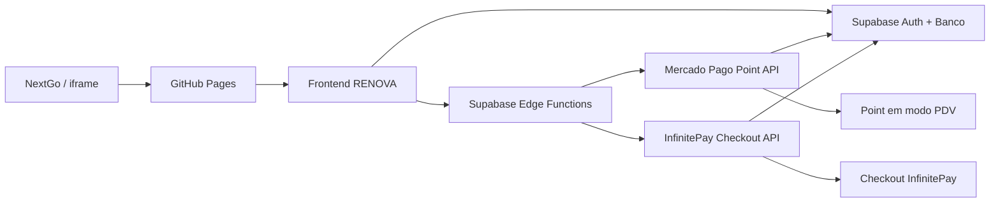
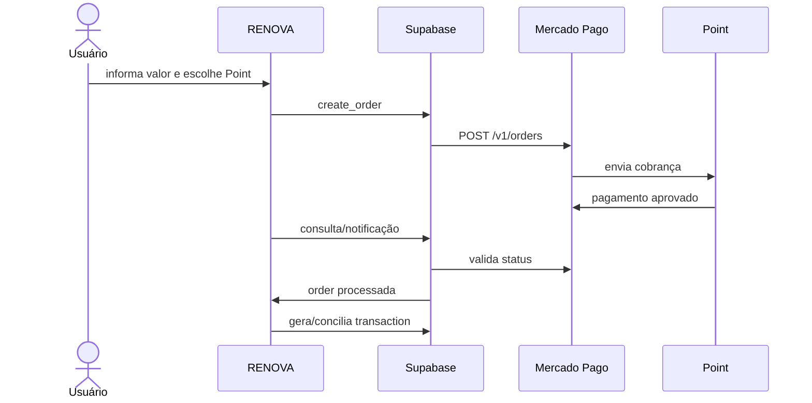
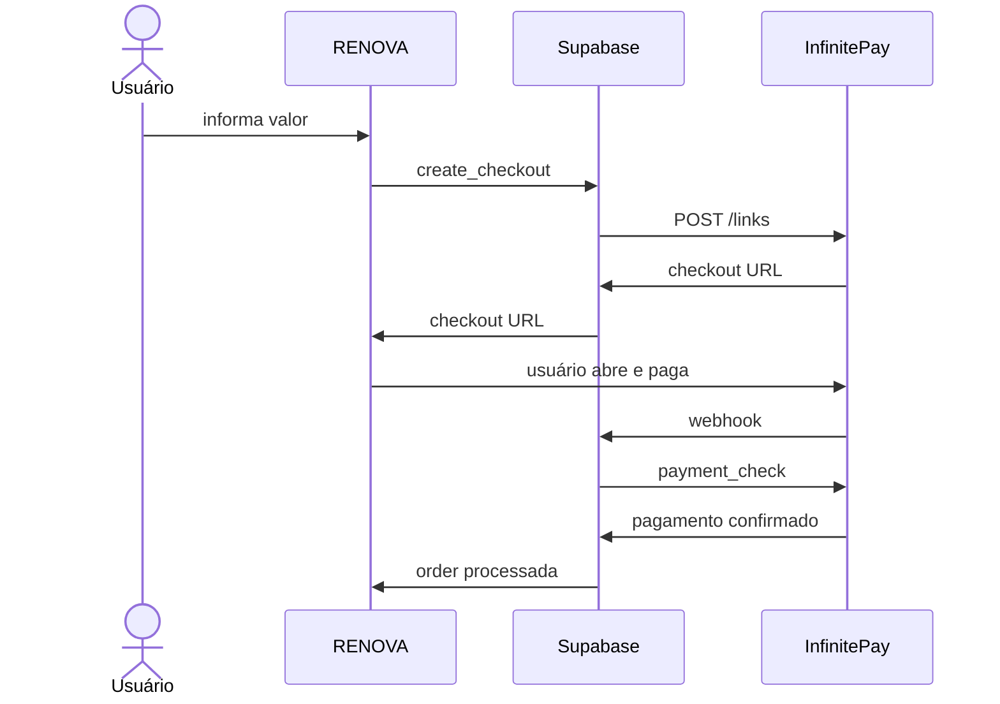

# Pagamentos e maquininhas — Minhas Finanças RENOVA

> Documento técnico oficial da integração de pagamentos do projeto **Minhas Finanças RENOVA Web**.
>
> Atualizado em: 14/09/2026
>
> Escopo ativo: **Mercado Pago + InfinitePay**.

## 1. Objetivo

O Minhas Finanças RENOVA deve permitir que o usuário registre e concilie recebimentos em dinheiro, Pix, débito e crédito e, quando o provedor permitir, inicie a cobrança diretamente a partir do sistema.

A regra de arquitetura é simples: **nenhuma credencial privada pode ficar no HTML, JavaScript público, GitHub Pages ou iframe da NextGo**. Toda ação sensível passa pelo backend Supabase.



## 2. Estado atual

| Item | Estado |
|---|---|
| Formas de recebimento: Dinheiro, Pix, Débito, Crédito e Outro | Implementado |
| Cadastro de maquininhas | Implementado |
| Taxa de débito/crédito por maquininha | Implementado |
| Bruto, taxa e líquido por venda | Implementado |
| Histórico preserva a taxa usada na data da venda | Implementado |
| Fundação multi-provedor no Supabase | Implementada |
| Mercado Pago Point — backend | Implementado |
| Mercado Pago Point — listar terminais | Implementado |
| Mercado Pago Point — mudar terminal para PDV | Implementado |
| Mercado Pago Point — criar/consultar/cancelar order | Implementado |
| InfinitePay Checkout — backend | Implementado |
| InfinitePay — salvar InfiniteTag | Implementado |
| InfinitePay — gerar checkout | Implementado |
| InfinitePay — payment_check | Implementado |
| InfinitePay — webhook verificado por payment_check | Implementado |
| Mercado Pago OAuth por usuário | Próxima etapa |
| Interface final “Buscar minhas maquininhas / Cobrar” | Próxima etapa |
| Conciliação automática final `payment_order -> transaction` | Próxima etapa |
| InfiniteTap no iframe/web | Preparado arquiteturalmente; exige estratégia de retorno por deep link/app |

## 3. Banco de dados

### `payment_terminals`

Tabela das maquininhas/provedores cadastrados pelo usuário.

Campos principais:

- `user_id`: dono da configuração.
- `name`: nome amigável da maquininha.
- `provider`: provedor.
- `external_terminal_id`: ID/serial externo.
- `debit_fee_percent`: taxa de débito.
- `credit_fee_percent`: taxa de crédito.
- `integration_status`: manual, pendente, conectada ou erro.
- `connection_id`: vínculo com uma conexão do provedor.
- `integration_mode`: modo de integração.

### `payment_provider_connections`

Representa a conexão do usuário com um provedor.

Campos principais:

- `user_id`
- `provider`
- `connection_type`
- `status`
- `display_name`
- `account_reference`
- `metadata`

**Não armazenar Access Token, Client Secret ou qualquer segredo nessa tabela.** Tokens devem ficar em secrets do backend ou ser obtidos por OAuth e armazenados em mecanismo seguro.

### `payment_orders`

Representa uma cobrança externa antes de virar uma movimentação financeira definitiva.

Campos principais:

- `user_id`
- `provider`
- `connection_id`
- `terminal_id`
- `provider_order_id`
- `provider_payment_id`
- `external_reference`
- `amount`
- `payment_method`
- `installments`
- `status`
- `status_detail`
- `transaction_id`
- `provider_data`

O navegador autenticado só pode consultar as próprias orders. Escritas de order são feitas pelo backend com `service_role`.

## 4. Movimentações e taxas

A tabela `transactions` possui os campos:

- `gross_amount`
- `payment_method`
- `payment_terminal_id`
- `payment_fee_percent`
- `payment_fee_amount`

Para uma receita de cartão:

```text
Valor bruto = R$ 100,00
Taxa = 2,00%
Taxa monetária = R$ 2,00
Valor líquido / transactions.amount = R$ 98,00
```

A porcentagem e o valor da taxa são gravados na própria transação. Se a taxa atual da maquininha mudar futuramente, vendas antigas não são recalculadas.

## 5. Mercado Pago Point

### Terminais compatíveis documentados pelo Mercado Pago

A documentação atual do Mercado Pago lista os seguintes terminais para integração com sistema PDV:

- Point Smart 1
- Point Smart 2
- Point Pro 2
- Point Pro 3

A **Point Mini não aparece na lista oficial de terminais integráveis pela API Point/Orders**. No RENOVA ela pode continuar cadastrada em modo manual/assistido para controle de taxa, bruto e líquido, mas não deve ser tratada como terminal PDV automatizado sem documentação oficial específica.

Referências oficiais:

- https://www.mercadopago.com.br/developers/pt/docs/mp-point/overview
- https://www.mercadopago.com.br/developers/pt/docs/mp-point/configure-terminal
- https://www.mercadopago.com.br/developers/pt/docs/mp-point/payment-processing
- https://www.mercadopago.com.br/developers/pt/reference/in-person-payments/point/overview

### Edge Function

Arquivo versionado:

`supabase/functions/mercado-pago-point/index.ts`

Função publicada no Supabase:

`mercado-pago-point`

Ações atuais:

#### `list_terminals`

Consulta:

`GET /terminals/v1/list`

Permite descobrir os terminais vinculados à conta Mercado Pago.

#### `setup_terminal`

Consulta:

`PATCH /terminals/v1/setup`

Alterna entre:

- `PDV`
- `STANDALONE`

Para receber cobrança enviada pelo RENOVA, o terminal precisa estar em **PDV**.

#### `create_order`

Consulta:

`POST /v1/orders`

Cria uma cobrança Point usando a API atual de Orders. A order recebe:

- terminal de destino;
- valor;
- débito ou crédito;
- parcelas;
- referência externa;
- chave de idempotência.

A order criada também é registrada em `payment_orders`.

#### `get_order`

Consulta:

`GET /v1/orders/{id}`

Atualiza o status da order armazenada no RENOVA.

#### `cancel_order`

Cancela uma order ainda válida e registra a mudança de estado.

### Segurança atual do Mercado Pago

Existe um `MP_ACCESS_TOKEN` usado pelo backend do projeto. Enquanto o OAuth individual ainda não estiver implantado, a função Point bloqueia usuários comuns e permite o token global **somente para a Conta Dono**.

Isso evita que uma venda de outro usuário seja processada acidentalmente na conta Mercado Pago do proprietário do RENOVA.

Para liberar a Point para todos os usuários, implementar **OAuth Mercado Pago por usuário**. A própria documentação do Mercado Pago orienta OAuth para integrações em nome de terceiros.

## 6. InfinitePay

A InfinitePay oferece oficialmente duas integrações para desenvolvedores:

1. **InfiniteTap** — pagamento presencial por aproximação usando o celular como maquininha.
2. **Checkout Integrado** — link/checkout gerado via API para Pix e cartão.

Referências oficiais:

- https://www.infinitepay.io/desenvolvedores
- https://www.infinitepay.io/checkout
- https://www.infinitepay.io/checkout-documentacao
- https://www.infinitepay.io/checkout-tap
- https://ajuda.infinitepay.io/pt-BR/articles/10766888-como-usar-o-checkout-integrado-da-infinitepay

### Edge Function `infinitepay-checkout`

Arquivo:

`supabase/functions/infinitepay-checkout/index.ts`

Ações:

#### `save_connection`

Salva a InfiniteTag do usuário em `payment_provider_connections`.

A InfiniteTag não é tratada como segredo. Ainda assim, o registro fica isolado por usuário.

#### `create_checkout`

Cria a `payment_order` no RENOVA e envia:

`POST https://api.checkout.infinitepay.io/links`

O payload contém:

- `handle` / InfiniteTag;
- `redirect_url`;
- `webhook_url`;
- `order_nsu`;
- itens e valores em centavos.

O link devolvido fica armazenado junto à order.

#### `payment_check`

Consulta:

`POST https://api.checkout.infinitepay.io/payment_check`

O RENOVA valida:

- `handle`;
- `order_nsu`;
- `transaction_nsu`;
- `slug`;
- confirmação de pagamento;
- valor esperado.

### Edge Function `infinitepay-webhook`

Arquivo:

`supabase/functions/infinitepay-webhook/index.ts`

A função é pública porque é chamada pelo provedor, mas **não confia cegamente no payload recebido**. Antes de marcar a order como processada, chama `payment_check` na InfinitePay e compara o valor confirmado com o valor da order do RENOVA.

O resultado verificado é persistido em `payment_orders.provider_data`.

### InfiniteTap

O fluxo oficial usa deep link para abrir o app InfinitePay e outro deep link (`result_url`) para retornar ao aplicativo de origem.

Exemplo conceitual:

```text
RENOVA -> infinitepaydash://infinitetap-app?... -> App InfinitePay -> resultado -> app de origem
```

O Minhas Finanças RENOVA atual roda como web app dentro de iframe/NextGo. Por isso, **não ativar retorno automático do InfiniteTap como se fosse um app nativo** até definirmos uma destas estratégias:

- PWA com protocolo/Universal Link compatível;
- wrapper Android/iOS;
- aplicativo RENOVA com deep link próprio.

O banco já prevê `infinitepay_tap`, evitando refazer a modelagem no futuro.

## 7. Fluxo final desejado — Point



## 8. Fluxo final desejado — InfinitePay Checkout



## 9. Secrets e variáveis

### Mercado Pago

Backend:

- `MP_ACCESS_TOKEN`
- `MP_WEBHOOK_SECRET` quando aplicável ao webhook Mercado Pago

Nunca colocar esses valores no repositório.

### InfinitePay

O Checkout Integrado documentado utiliza a InfiniteTag/handle no payload. O backend do RENOVA mantém a lógica de criação e verificação da order centralizada no Supabase.

### Geral

- `SUPABASE_URL`
- `SUPABASE_ANON_KEY`
- `SUPABASE_SERVICE_ROLE_KEY`
- `APP_PUBLIC_URL` opcional; fallback atual: `https://minhasfinancas.servicosgold.com.br/`

## 10. Arquivos do projeto relacionados

Frontend:

- `js/payments-module.js`
- `css/payments-module.css`

Banco:

- `supabase/migrations/20260914_payment_methods_and_card_terminals.sql`
- `supabase/migrations/20260914_payment_provider_integrations_foundation.sql`

Backend:

- `supabase/functions/mercado-pago-point/index.ts`
- `supabase/functions/infinitepay-checkout/index.ts`
- `supabase/functions/infinitepay-webhook/index.ts`

## 11. Checklist para a próxima etapa

1. Criar na tela **Recebimentos** a área “Integrações”.
2. Exibir apenas **Mercado Pago** e **InfinitePay** como integrações ativas.
3. Mercado Pago: botão **Buscar minhas maquininhas**.
4. Permitir selecionar Point Smart/Pro encontrada pela API.
5. Colocar terminal selecionado em modo PDV.
6. Criar botão **Cobrar na maquininha** no lançamento de receita.
7. Fazer a primeira cobrança de teste.
8. Configurar notificações/consulta de status e finalizar a conciliação automática.
9. InfinitePay: campo **Minha InfiniteTag** e botão **Conectar**.
10. Criar botão **Gerar checkout InfinitePay**.
11. Testar Pix e cartão com `payment_check` + webhook.
12. Implantar OAuth Mercado Pago antes de liberar Point automática para contas que não sejam a Conta Dono.

## 12. Regra permanente

O frontend nunca deve marcar uma receita como paga apenas porque conseguiu criar uma order ou abrir um checkout.

Uma receita automática só deve ser consolidada depois da confirmação do provedor. Para InfinitePay, usar `payment_check`. Para Mercado Pago Point, validar o estado final da order/notificação oficial.
